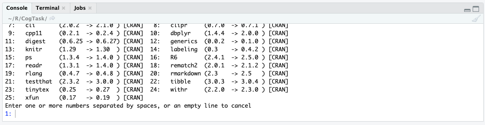

# NTUCogTask


## Installation
```
if (!requireNamespace("devtools")) install.packages("devtools")
devtools::install_github("tylin30/NTUCogTask")

library(NTUCogTask)
```

Note: During the installation, please check the console. It might ask user to update other R packages. Press 'Enter'.



<br><br>
<hr>
<br>

## How to use
<br>
1. cog_tidy

```
df <- cog_tidy("your_data_path", "Task_Code")
```

Put all your raw csv(s) in the same folder. cog_tidy will catch all csv(s) from the same task according to your Task_Code. This function will return a dataframe. Row is each subject (participant), Column is all the derived variables(feautures).
<br>
<br>
2. Create your own pipeline
```
df <- cog_rbindobs("your_data_path", "Task_Code") %>%
  cog_datatype(., "Task_Code") %>%
  cog_addnooutlier(., "Task_Code", range='outlier_range') %>%
  cog_mutate(., "Task_Code") %>%
  cog_unique(., "Task_Code") 
```

You could also create you piple line and decide your inter-person outlier range (sd).

<br>
<hr>
<br>

## Task Code Table

| Task Name  |  Task Code |
|---|---|
|Simple Reaction Time & Choice Reaction Time   | SRT_CRT  |
|Delayed Matching to Sample   |DMS   |
|Memory of Association   |MA   |
|Memory of Association - Object   |MAO   |
|Delayed Response Task   |DR   |
|Spatial Memory Task   |SM   |
|Running Memory of Symbols   |RMS   |
|Running Memory of Objects   |RMO   |
|Running Memory of Locations   |RML   |
|Rotation Span Task   |RS   |
|Stop Signal Task   |SST   |
|Stroop Task   |Sp   |
|Antisaccade Arrow   |As   |
|Color Trail Test   |CTT   |
|Hearts and Flowers   |HF   |
|Figure Task   |Fg   |

<br>
<br>
<hr>
<br>
Enjoy! Comments or feedback are more than welcome.

e-mail: tylin.amice@gmail.com
